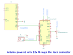

# SERVO MOTOR DEMO - DOCUMENTATION

## 1. What the Demo Does

The Servo Motor demo demonstrates how to control a servo motor using an external display or a potentiometer. The project highlights real-time communication between the display and the Arduino through the Lumen Protocol. The display can directly control the servo's position or allow manual control via a potentiometer.

This project showcases the display's ability to send and receive real-time data, providing seamless integration with hardware components like servos.

## 2. Purpose

The primary purpose of this project is to demonstrate the capabilities of the display in communicating with external hardware, such as controlling a servo motor. It highlights:
- Real-time data exchange between the display and the Arduino.
- Displaying the servo's current position.
- Switching between display control and manual control via potentiometer.

This demo is ideal for showcasing the display's role in interactive hardware control applications.

## 3. How to Use

### 3.1 Setting Up the Hardware

1. Connect the servo motor to the Arduino:
   - **Control Pin**: Connect to **Pin 9** on the Arduino.
   - **Power and GND**: Connect the servo motor's power and ground to the Arduino's 5V and GND pins, respectively.

2. Connect the potentiometer to the Arduino:
   - **Analog Pin**: Connect the middle pin of the potentiometer to **A0**.
   - **Power and GND**: Connect the remaining pins of the potentiometer to 5V and GND on the Arduino.

3. Connect the display to the Arduino via a serial connection.

### 3.2 Operating Modes

The project supports two modes of control:
1. **Display-Controlled Mode**:
   - The display sends packets to set the servo's angle (0-180°).
   - The current servo position is sent back to the display in real-time.

2. **Potentiometer-Controlled Mode**:
   - The potentiometer manually adjusts the servo's angle.
   - The servo's current position is also sent to the display for visualization.

### 3.3 Switching Between Modes

The display sends a control packet to toggle between **Display control** or **Potentiometer control**.

### 3.4 Power Supply

- The Arduino can be powered via USB (5V) or an external power supply.

## 4. Schematic Circuit

Below is the schematic circuit for the Servo Motor demo:



## 5. Functionality Explanation

1. **Real-Time Communication**:
   - The display uses the Lumen Protocol to send and receive packets with the Arduino.
   - Packets include the servo's desired position and control mode.

2. **Servo Movement**:
   - In display-controlled mode, the servo moves to the angle specified by the display.
   - In potentiometer-controlled mode, the servo's angle is determined by the potentiometer's position.

## 6. Code Overview

### Key Features:
- **Lumen Protocol**: Handles serial communication between the display and Arduino.
- **Servo Control**: Adjusts the servo's position based on packets or potentiometer input.

```cpp
#include "LumenProtocol.h"
#include <Servo.h>

extern "C" void lumen_write_bytes(uint8_t *data, uint32_t length) {
  Serial.write(data, length);
}

extern "C" uint16_t lumen_get_byte() {
  if (Serial.available()) {
    return Serial.read();
  }
  return DATA_NULL;
}

#define LCM_BAUDRATE 115200

Servo ServoMotor;

const int SERVO_PIN = 9;    
const int ANALOG_PIN = A0;  

const uint16_t CURRENT_ANGLE_ADDRESS = 147;
const uint16_t CONTROL_DEVICE_SELECTOR_ADDRESS = 148;

lumen_packet_t currentAnglePacket = { CURRENT_ANGLE_ADDRESS, kS16 };
lumen_packet_t controlDeviceSelectorPacket = { CONTROL_DEVICE_SELECTOR_ADDRESS, kBool };
lumen_packet_t *currentPacket;

int positionSetpoint = 0;    
int basePosition = 0;        
bool updatePosition = false; 
bool controlSelect = false;  

void sendServoPosition(int angle) {
  lumen_packet_t anglePacket = { CURRENT_ANGLE_ADDRESS, kS16 };
  anglePacket.data._s16 = static_cast<int16_t>(angle);
  lumen_write_packet(&anglePacket);
}

void updateServoFromPotentiometer() {
  long potValue = analogRead(ANALOG_PIN);              
  int servoPosition = map(potValue, 0, 1023, 0, 180);  

  ServoMotor.write(servoPosition);   
  sendServoPosition(servoPosition);  

  delay(75);  
}

void processDisplayPackets() {
  if (lumen_available() > 0) {
    currentPacket = lumen_get_first_packet();

    if (currentPacket->address == CONTROL_DEVICE_SELECTOR_ADDRESS) {
      controlSelect = currentPacket->data._bool;  
    } else if (currentPacket->address == CURRENT_ANGLE_ADDRESS) {
      updatePosition = true;
      positionSetpoint = currentPacket->data._s16;
      ServoMotor.write(positionSetpoint);

      if (updatePosition && basePosition != positionSetpoint) {
        basePosition = positionSetpoint;
      } else {
        updatePosition = false;
      }
    }
  }
}

void setup() {
  Serial.begin(LCM_BAUDRATE);
  ServoMotor.attach(SERVO_PIN);
  updatePosition = true;
}

void loop() {
  processDisplayPackets();  

  if (controlSelect) {
    updateServoFromPotentiometer();
  }
}
